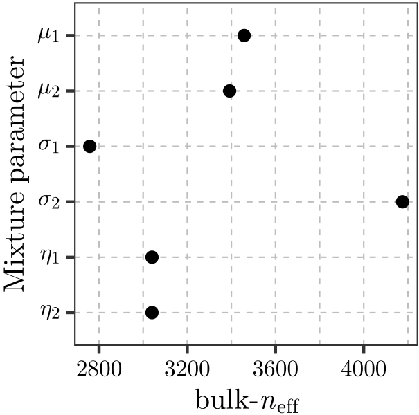

# LaTeX-Styling-ggplot2

Styling R ggplot2 graphics with LaTeX.

---

<figure style="width:300px;">
  
  <figcaption>Figure 1. Example R ggplot2 output, showing the results of Markov Chain Monte Carlo convergence testing for a mixture model. The y-axis tick mark labels and x-axis label were styled using LaTeX. Image adapted from Stenborg (2023), below.</figcaption>
</figure>

---

### Key Files

- TUGboat_44_108.R &nbsp;&nbsp; R code. 

### Software Requirements

- Ghostscript 10.00.0. 
- R. 
- An R IDE, e.g., RStudio (optional). 

N.B. The code was not designed for use with Ghostscript more recent than version 10.00.0.

### System Configuration

Please ensure the R installation has the following packages installed:

- egg
- extrafont
- ggplot2
- gridExtra
- knitr
- latex2exp

Detailed system configuration details are provided in Stenborg (2023), below.

### Reference

Stenborg, T 2023, "[Styling R ggplot2 graphics with LaTeX](https://tug.org/TUGboat/tb44-1/tb136stenborg-ggplot2.pdf)", TUGboat, vol. 44, no. 1, pp. 108&ndash;109.
